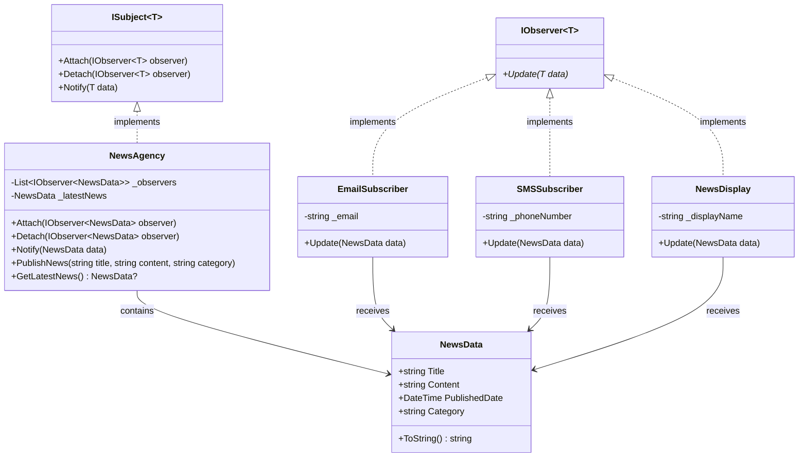

# Proyecto Comportamiento - Patrones de Diseño

## Descripción General

Este proyecto implementa el **Patrón Observer**, un patrón de diseño de comportamiento que establece una dependencia uno-a-muchos entre objetos, de manera que cuando un objeto cambia de estado, todos sus dependientes son notificados automáticamente.

## Tabla de Contenidos

1. [Implementación del Patrón Observer](#implementación-del-patrón-observer)
2. [Estructura del Proyecto](#estructura-del-proyecto)
3. [Automatización con GitHub Actions](#automatización-con-github-actions)
4. [Publicación de Documentación](#publicación-de-documentación)
5. [Gestión de Paquetes NuGet](#gestión-de-paquetes-nuget)
6. [Releases y Versionamiento](#releases-y-versionamiento)
7. [Guía de Uso](#guía-de-uso)

## Implementación del Patrón Observer

### Diagrama del Patrón Observer



### Componentes Principales

#### Interfaces

**IObserver<T>**
```csharp
public interface IObserver<T>
{
    void Update(T data);
}
```

**ISubject<T>**
```csharp
public interface ISubject<T>
{
    void Attach(IObserver<T> observer);
    void Detach(IObserver<T> observer);
    void Notify(T data);
}
```

#### Clases Concretas

**NewsAgency (Subject)**
```csharp
public class NewsAgency : ISubject<NewsData>
{
    private readonly List<IObserver<NewsData>> _observers;
    private NewsData? _latestNews;

    public void PublishNews(string title, string content, string category)
    {
        var newsData = new NewsData(title, content, category);
        Notify(newsData);
    }
}
```

**NewsData**
```csharp
public class NewsData
{
    public string Title { get; set; }
    public string Content { get; set; }
    public DateTime PublishedDate { get; set; }
    public string Category { get; set; }
}
```

**Observadores Concretos**
- **EmailSubscriber**: Simula envío de emails
- **SMSSubscriber**: Simula envío de SMS
- **NewsDisplay**: Simula visualización en pantalla

## Estructura del Proyecto

```
Comportamiento/
├── Comportamiento.sln                    # Solución principal
├── Comportamiento.Domain/                # Proyecto de dominio
│   ├── IObserver.cs                     # Interface Observer
│   ├── ISubject.cs                      # Interface Subject
│   ├── NewsAgency.cs                    # Subject concreto
│   ├── NewsData.cs                      # Modelo de datos
│   ├── EmailSubscriber.cs               # Observer Email
│   ├── SMSSubscriber.cs                 # Observer SMS
│   ├── NewsDisplay.cs                   # Observer Display
│   └── Comportamiento.Domain.csproj     # Configuración NuGet
└── Comportamiento.Domain.Tests/          # Proyecto de pruebas
    ├── UnitTest1.cs                     # Tests del patrón Observer
    └── Comportamiento.Domain.Tests.csproj
```

## Automatización con GitHub Actions

### 1. Publicación de Documentación (`publish_docs.yml`)

**Características:**
- Genera documentación usando DocFX
- Publica en GitHub Pages
- Se ejecuta en push a `main` y `develop`

**Pasos del Workflow:**
1. **Checkout**: Obtiene el código fuente
2. **Setup .NET**: Instala .NET 9.0
3. **Install DocFX**: Instala la herramienta DocFX
4. **DocFX Init**: Inicializa el proyecto de documentación
5. **Generate Metadata**: Crea metadatos de la API
6. **Build Documentation**: Genera sitio HTML
7. **Upload to Pages**: Publica en GitHub Pages

**Configuración DocFX:**
```json
{
  "metadata": [
    {
      "src": ["Comportamiento.Domain/Comportamiento.Domain.csproj"],
      "dest": "api"
    }
  ],
  "build": {
    "content": [
      {"files": ["api/**.yml"]},
      {"files": ["articles/**.md", "toc.yml", "*.md"]}
    ],
    "dest": "_site"
  }
}
```

### 2. Empaquetado y Análisis (`package_nuget.yml`)

**Características:**
- Ejecuta pruebas unitarias con cobertura
- Análisis SonarCloud
- Construye paquetes NuGet
- Publica en GitHub Packages

**Pasos del Workflow:**
1. **Test**: Ejecuta pruebas y genera reportes
2. **SonarCloud**: Análisis estático de código
3. **Pack Payment**: Crea paquete Payment.Domain
4. **Pack ATM**: Crea paquete ATM.Domain
5. **Publish**: Publica en GitHub Packages

### 3. Versiones y Releases (`release_version.yml`)

**Características:**
- Se ejecuta con tags de versión (v*.*.*)
- Crea releases formales en GitHub
- Incluye paquetes como assets descargables

**Triggers:**
- Tags de versión: `v1.0.0`, `v2.1.3`
- Disparo manual con versión personalizada

## Guía de Uso Paso a Paso

### Paso 1: Explorar el Patrón Observer

1. **Revisar las Interfaces**
   ```csharp
   // Interface Observer
   public interface IObserver<T>
   {
       void Update(T data);
   }

   // Interface Subject
   public interface ISubject<T>
   {
       void Attach(IObserver<T> observer);
       void Detach(IObserver<T> observer);
       void Notify(T data);
   }
   ```

2. **Examinar la Implementación**
   ```csharp
   // Crear agencia de noticias
   var newsAgency = new NewsAgency();

   // Crear y suscribir observadores
   var emailSub = new EmailSubscriber("user@example.com");
   var smsSub = new SMSSubscriber("+1234567890");

   newsAgency.Attach(emailSub);
   newsAgency.Attach(smsSub);

   // Publicar noticia - todos reciben notificación
   newsAgency.PublishNews("Título", "Contenido", "Categoría");
   ```

### Paso 2: Ejecutar Pruebas

```bash
# Desde el directorio Comportamiento/
dotnet test

# Resultado esperado:
# ✅ 9 pruebas pasaron
# ✅ Cobertura de código generada
# ✅ Reportes de prueba disponibles
```

### Paso 3: Construir Paquetes NuGet

```bash
# Construir paquetes
dotnet pack Payment/Payment.Domain/Payment.Domain.csproj
dotnet pack ATM/ATM.Domain/ATM.Domain.csproj

# Paquetes generados:
# - Payment.Domain.1.0.0.nupkg
# - ATM.Domain.1.0.0.nupkg
```

### Paso 4: Crear Release

```bash
# Crear tag de versión
git tag v1.0.0
git push origin v1.0.0

# El workflow automáticamente:
# - Ejecuta pruebas y análisis
# - Construye paquetes
# - Crea GitHub Release
# - Publica en GitHub Packages
```

### Paso 5: Usar los Paquetes

```bash
# Agregar fuente de GitHub Packages
dotnet nuget add source --name github "https://nuget.pkg.github.com/{owner}/index.json"

# Instalar paquetes
dotnet add package Payment.Domain --version 1.0.0
dotnet add package ATM.Domain --version 1.0.0
```

## Características Técnicas

### Patrón Observer Implementado

**Ventajas:**
- ✅ **Acoplamiento Flexible**: Subject y observers débilmente acoplados
- ✅ **Principio Abierto/Cerrado**: Agregar observers sin modificar subject
- ✅ **Relaciones Dinámicas**: Observers pueden agregarse/removerse en tiempo de ejecución
- ✅ **Comunicación Broadcast**: Un subject notifica múltiples observers
- ✅ **Type Safety**: Interfaces genéricas aseguran type safety

**Comparación con Strategy:**
- **Observer**: Comunicación uno-a-muchos, notificaciones push
- **Strategy**: Encapsulación de algoritmos, substitución de algoritmos

### Automatización Completa

**Tres Workflows GitHub Actions:**

1. **Documentación**: DocFX → GitHub Pages
2. **CI/CD**: Pruebas + SonarCloud + GitHub Packages
3. **Releases**: Versiones formales + assets descargables

### Calidad de Código

**Métricas Implementadas:**
- ✅ Pruebas unitarias con cobertura
- ✅ Análisis SonarCloud
- ✅ Reportes de cobertura Codecov
- ✅ Quality gates antes de releases

## Recursos Adicionales

### Documentación Generada
- **GitHub Pages**: Documentación completa en `/docs`
- **API Reference**: Documentación automática de clases
- **Artículos**: Guías detalladas del patrón Observer

### Paquetes Disponibles
- **Payment.Domain**: Implementación Strategy pattern
- **ATM.Domain**: Implementación Command pattern
- **Comportamiento.Domain**: Implementación Observer pattern

### Comandos Útiles

```bash
# Construir solución
dotnet build Comportamiento/Comportamiento.sln

# Ejecutar pruebas
dotnet test Comportamiento/Comportamiento.sln

# Construir documentación
cd Comportamiento && docfx build

# Crear paquetes
dotnet pack Payment/Payment.Domain/Payment.Domain.csproj
dotnet pack ATM/ATM.Domain/ATM.Domain.csproj

# Crear release
git tag v1.0.0 && git push origin v1.0.0
```

## Conclusión

Este proyecto demuestra la implementación completa del patrón Observer junto con una infraestructura robusta de CI/CD que incluye:

- ✅ **Implementación sólida** del patrón Observer
- ✅ **Automatización completa** con GitHub Actions
- ✅ **Documentación profesional** con DocFX
- ✅ **Distribución de paquetes** vía NuGet y GitHub Packages
- ✅ **Gestión de versiones** con releases formales
- ✅ **Calidad de código** con pruebas y análisis

El proyecto sirve como ejemplo completo de cómo implementar patrones de diseño de comportamiento con prácticas modernas de desarrollo de software.